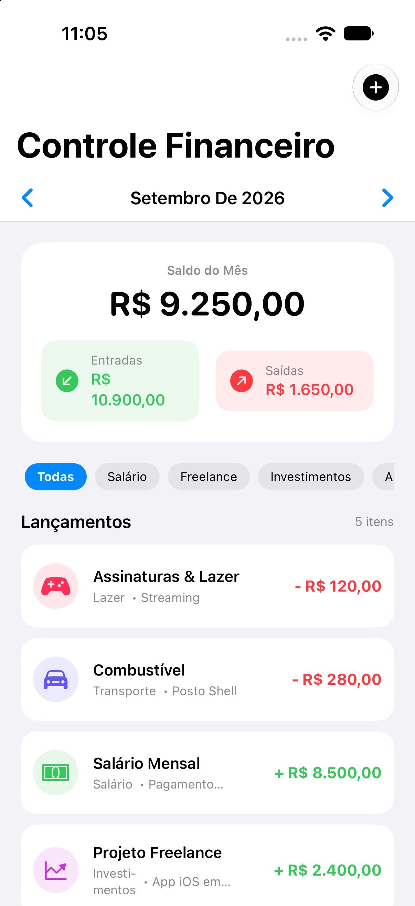

# 3️⃣ Controle Financeiro

**Nível:** Intermediário 🟡 | **Diretório:** `/ControleFinanceiro` | **Status:** ✅ Concluído (SwiftData + iOS 17+)

Sistema completo de controle de receitas e despesas pessoais com **SwiftData**, visualização de saldo mensal e filtros por categoria e período em SwiftUI.

---

## 🎯 Sobre o Projeto

O aplicativo permite ao usuário registrar transações de entradas (receitas) e saídas (despesas), categorizá-las (Salário, Alimentação, Moradia, Transporte, Lazer, etc.), visualizar o saldo consolidado do mês com total de receitas e despesas, navegar entre meses passados/futuros e filtrar por categorias específicas.

---

## 📱 Screenshots

| Dashboard Financeiro | Novo Lançamento |
| :---: | :---: |
|  |  |

---

## 🛠️ Tecnologias e Arquitetura

- **Linguagem & Framework**: Swift, SwiftUI
- **Compatibilidade**: `iOS 17+`
- **Persistência Local**: `SwiftData` (`@Model final class FinancialTransaction`)
- **Visualização de Dados**: `@Query` reativo no SwiftUI
- **Arquitetura**: MVVM com SwiftData Container
- **Testes Unitários**: XCTest em `ControleFinanceiroTests` com container in-memory (100% dos testes aprovados)

---

## 📱 Funcionalidades

- Resumo financeiro do mês (Saldo Total, Entradas e Saídas).
- Seletor de mês/ano com navegação anterior/próximo.
- Lista de lançamentos com ícone da categoria, tipo (Receita vs Despesa), data e valor formatado em BRL (`R$ 1.234,56`).
- Formulário em Sheet (`AddTransactionView`) com validação de campos obrigatórios e valores numéricos finitos.
- Filtro de lançamentos por categorias via chips horizontais.
- Exclusão de transações via menu de contexto.

---

## 🚀 Como Executar

1. Abra `ControleFinanceiro/ControleFinanceiro.xcodeproj` no Xcode.
2. Selecione o esquema `ControleFinanceiro` e um iPhone Simulator (ex: iPhone 18 Pro).
3. Pressione `⌘R` para compilar e executar.
4. Para rodar os testes unitários:
   ```bash
   swift test --package-path ControleFinanceiro
   ```

---

## 📂 Estrutura de Pastas

```
ControleFinanceiro/
├── Screenshots/                # Screenshots do aplicativo executado no iOS Simulator
├── Models/                     # FinancialTransaction (@Model), TransactionCategory, TransactionType
├── Views/                      # FinanceDashboardView, AddTransactionView, TransactionRowView
├── Utilities/                  # CurrencyFormatter, Color+Extensions
├── ControleFinanceiroTests/    # Testes com SwiftData in-memory container
├── ControleFinanceiroApp.swift # Ponto de entrada com .modelContainer
└── Package.swift               # Configuração do Swift Package Manager
```
