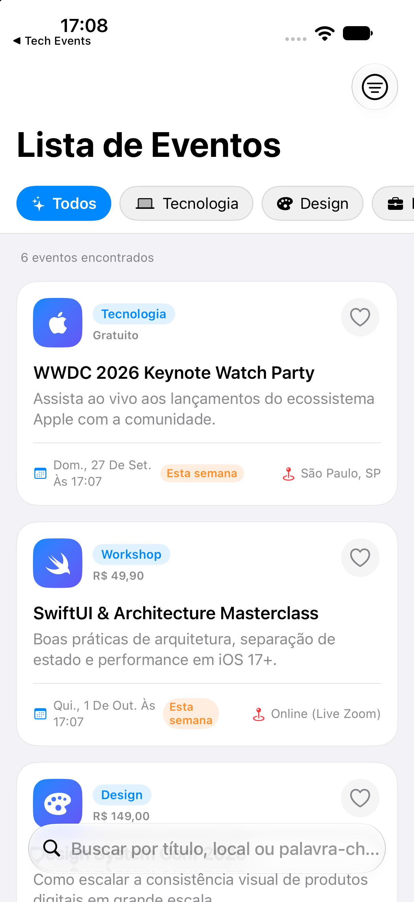
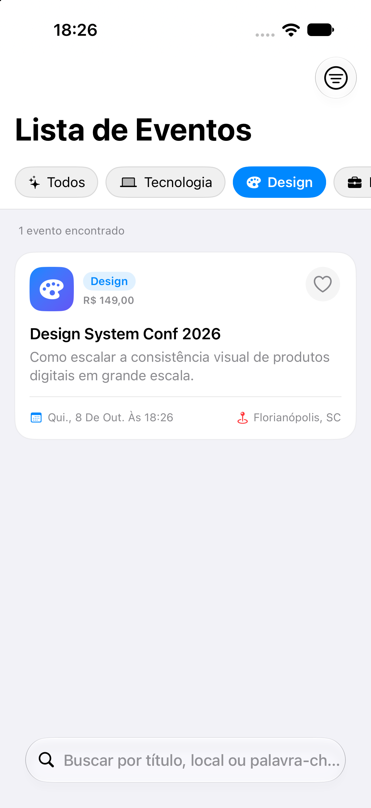
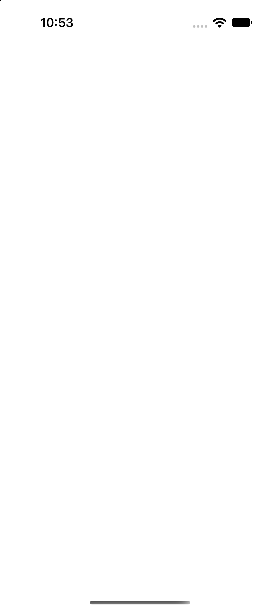

# 2️⃣ Lista de Eventos

**Nível:** Iniciante 🟢 | **Diretório:** `/ListaDeEventos` | **Status:** ✅ Concluído

Aplicativo iOS desenvolvido em **SwiftUI** (iOS 17+) para listagem, busca, filtragem por categoria, favoritos e navegação de detalhes de eventos tech/design/business.

---

## 🎯 Sobre o Projeto

O aplicativo permite visualizar eventos com cards interativos, realizar busca em tempo real por título, local ou organizador, filtrar eventos por categorias em chips horizontais, favoritar eventos (com persistência via `UserDefaults`) e visualizar a tela de detalhes com botão de inscrição e confirmação de vaga.

---

## 📱 Screenshots

| Catálogo de Eventos | Filtro por Categoria | Detalhes do Evento |
| :---: | :---: | :---: |
|  |  |  |

---

## 🛠️ Tecnologias e Arquitetura

- **Linguagem & Framework**: Swift, SwiftUI
- **Compatibilidade**: `iOS 17+`
- **Gerenciamento de Estado**: Macro `@Observable` (`EventsViewModel`)
- **Persistência**: `UserDefaults` (salvamento de eventos favoritos)
- **Navegação**: `NavigationStack` com navegação por tipo `Event`
- **Arquitetura**: MVVM + Service Layer (`EventServiceProtocol`)
- **Testes Unitários**: XCTest em `ListaDeEventosTests` (100% dos testes aprovados)

---

## 📱 Funcionalidades

- Lista de eventos com título, subtítulo, data formatada, localização, ícone e badge de preço/categoria.
- Busca local em tempo real por palavras-chave (`.searchable`).
- Carrossel horizontal de seleção de categorias (Todas, Tecnologia, Design, Negócios, Workshop, Carreira).
- Ordenação configurável por Data (Mais Próxima / Mais Distante) e Nome (A-Z).
- Sistema de Favoritos com ícone de coração e persistência local.
- Tela de Detalhes rica com banner decorativo, informações organizadas, vaga e botão interativo de inscrição.
- Tratamento de Empty State (`ContentUnavailableView`) com ação para limpar filtros.

---

## 🚀 Como Executar

1. Abra `ListaDeEventos/ListaDeEventos.xcodeproj` no Xcode.
2. Selecione o esquema `ListaDeEventos` e um iPhone Simulator (ex: iPhone 18 Pro).
3. Pressione `⌘R` para compilar e executar.
4. Para rodar os testes unitários via linha de comando:
   ```bash
   swift test --package-path ListaDeEventos
   ```

---

## 📂 Estrutura de Pastas

```
ListaDeEventos/
├── Screenshots/         # Screenshots do aplicativo executado no iOS Simulator
├── Models/              # Modelo Event, EventCategory e SortOption
├── Services/            # Service protocol e provedor de eventos sample
├── ViewModels/          # EventsViewModel com filtragem, busca e favoritos
├── Views/               # EventListView, EventDetailView, EventCardView, CategoryChipView
├── Utilities/           # Extensões de Date e Color (suporte Dark Mode e cross-platform)
├── ListaDeEventosTests/ # Testes unitários para filtros e persistência
├── ListaDeEventosApp.swift # Ponto de entrada do aplicativo
└── Package.swift        # Configuração do Swift Package Manager
```
