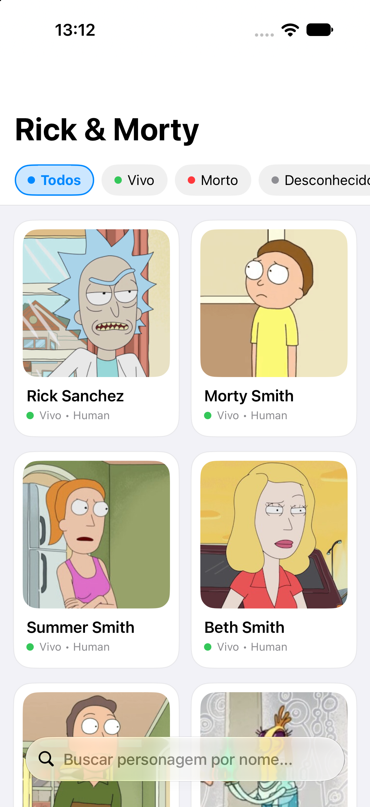
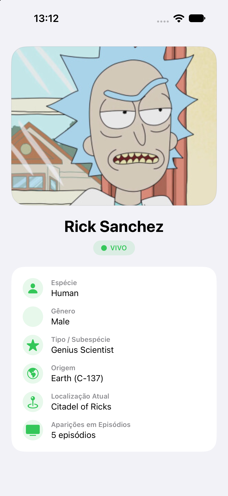

# 4️⃣ Rick & Morty Characters

**Nível:** Intermediário 🟡 | **Diretório:** `/RickAndMortyCharacters` | **Status:** ✅ Concluído

Aplicativo iOS em **SwiftUI** integrado à API oficial do Rick & Morty (`https://rickandmortyapi.com/api/character`), com consumo de serviços via `async/await`, busca com debounce, paginação infinita, tratamento robusto de erros e tela de detalhes.

---

## 🎯 Sobre o Projeto

O aplicativo permite explorar todos os personagens da franquia Rick & Morty consumindo dados reais da REST API. Conta com busca por nome em tempo real com debounce, filtro por status (Vivo, Morto, Desconhecido), carregamento de imagem com `AsyncImage`, paginação conforme a rolagem do usuário e tela de detalhes contendo atributos, espécie, origem, localização e quantidade de aparições.

---

## 📱 Screenshots

| Lista de Personagens | Detalhes do Personagem |
| :---: | :---: |
|  |  |

---

## 🛠️ Tecnologias e Arquitetura

- **Linguagem & Framework**: Swift, SwiftUI
- **Compatibilidade**: `iOS 17+`
- **Networking**: `URLSession`, `async/await`, `JSONDecoder`
- **API**: [Rick and Morty API](https://rickandmortyapi.com)
- **Gerenciamento de Estado**: Macro `@Observable` (`CharactersViewModel`)
- **Arquitetura**: MVVM com desacoplamento via `RickAndMortyServiceProtocol`
- **Testes Unitários**: XCTest com mock service em `RickAndMortyCharactersTests` (100% dos testes aprovados)

---

## 📱 Funcionalidades

- Listagem em grid responsivo de personagens com imagem, nome, status e espécie.
- Busca por nome com **debounce de 400ms** para evitar chamadas excessivas.
- Chips horizontais de filtro de status (Vivo, Morto, Desconhecido).
- Paginação automática (infinite scrolling) conforme o usuário chega ao fim da lista.
- Tela de detalhes do personagem com imagem em alta resolução e informações completas.
- Tratamento visual de erros (sem conexão, erro no servidor) com botão de "Tentar Novamente".

---

## 🚀 Como Executar

1. Abra `RickAndMortyCharacters/RickAndMortyCharacters.xcodeproj` no Xcode.
2. Selecione o esquema `RickAndMortyCharacters` e um iPhone Simulator (ex: iPhone 18 Pro).
3. Pressione `⌘R` para compilar e executar.
4. Para rodar os testes unitários:
   ```bash
   swift test --package-path RickAndMortyCharacters
   ```

---

## 📂 Estrutura de Pastas

```
RickAndMortyCharacters/
├── Screenshots/                   # Screenshots do aplicativo executado no iOS Simulator
├── Models/                        # RMCharacter, RMStatus, RMLocationRef, RMPageInfo, RMCharacterResponse
├── Services/                      # RickAndMortyService, NetworkError
├── ViewModels/                    # CharactersViewModel (busca com debounce, paginação)
├── Views/                         # CharacterListView, CharacterDetailView, CharacterCardView
├── Utilities/                     # Color+Extensions
├── RickAndMortyCharactersTests/   # Testes unitários de parsing e erros de rede
├── RickAndMortyCharactersApp.swift # Ponto de entrada do aplicativo
└── Package.swift                  # Configuração do Swift Package Manager
```
