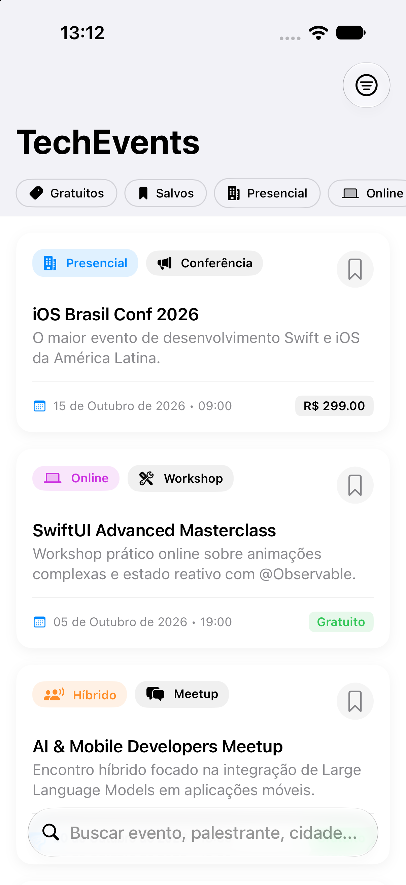
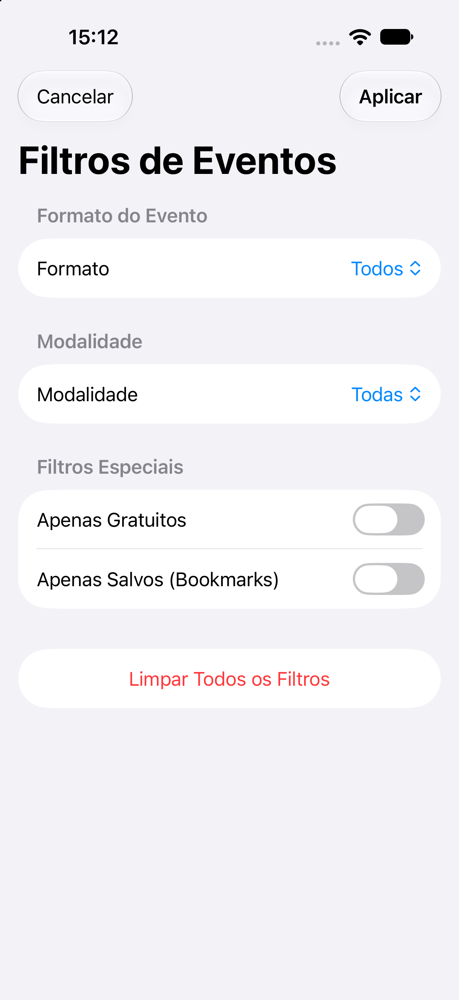

# 5️⃣ Tech Events

**Nível:** Avançado 🔴 | **Diretório:** `/TechEvents`

Aplicativo em SwiftUI com arquitetura em camadas, filtros avançados e estado reativo para eventos de tecnologia.

## 🎯 Objetivo
Consolidar arquitetura do app em Swift com casos de uso, repositório e apresentação SwiftUI desacoplada.

## 📱 Screenshots

| Catálogo de Eventos | Detalhes & Programação | Filtros Compostos |
| :---: | :---: | :---: |
|  |  |  |

## 🛠️ Tecnologias e Práticas
- `Swift 5 / 6`
- `SwiftUI`
- `iOS 17+`
- `MVVM + Domain + Data Layer`
- `@Observable` (Macro reativa do iOS 17+)
- `Separação domínio/dados`
- `Busca e filtros compostos`
- `Gestão de estado da UI`
- `XCTest (18 unit tests passing)`

## ✅ Requisitos para entrega
- Catálogo de eventos com filtros múltiplos (Formato: Presencial/Online/Híbrido; Modalidade: Conferência/Meetup/Hackathon/Workshop; Apenas Gratuitos; Apenas Favoritos; Busca textual).
- Estados vazios, carregamento e mensagens contextuais.
- Camada de dados desacoplada da UI com repositórios local e remoto mockado.
- Cobertura de fluxo principal com 18 testes unitários no XCTest.

---

## 📱 Implementação

### Estrutura de Pastas
```
TechEvents/
├── Screenshots/         # Screenshots do aplicativo executado no iOS Simulator
├── Sources/TechEvents/
│   ├── Domain/
│   │   ├── Models/ (TechEvent, EventFormat, EventModality, Speaker, ScheduleSlot)
│   │   └── UseCases/ (FetchEventsUseCase, FilterTechEventsUseCase)
│   ├── Data/
│   │   ├── Repositories/ (TechEventsLocalRepository, TechEventsRemoteRepository, Protocol)
│   │   └── Mock/ (MockEventsData)
│   ├── Presentation/
│   │   ├── ViewModels/ (TechEventsViewModel)
│   │   └── States/ (CompositeFilterState)
│   ├── Views/ (TechEventsCatalogView, TechEventCardView, FilterSheetView, TechEventDetailView, ScheduleSlotRowView)
│   └── Utilities/ (ColorExtensions)
├── Tests/TechEventsTests/
│   ├── FilterTechEventsUseCaseTests.swift
│   ├── TechEventsRepositoryTests.swift
│   └── TechEventsViewModelTests.swift
├── TechEventsApp.swift
├── Package.swift
└── TechEvents.xcodeproj
```

### Como Executar
1. Abra o arquivo `TechEvents.xcodeproj` no Xcode 15+.
2. Selecione o target `TechEvents` e um Simulator iOS 17+ (ex: iPhone 18 Pro).
3. Pressione `Cmd + R` para rodar o app.
4. Para executar a suíte de testes: `swift test --package-path TechEvents` no terminal ou `Cmd + U` no Xcode.
